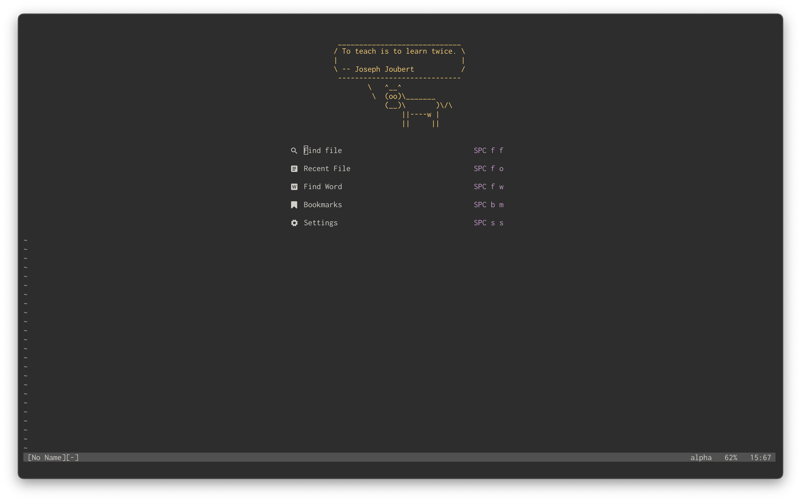
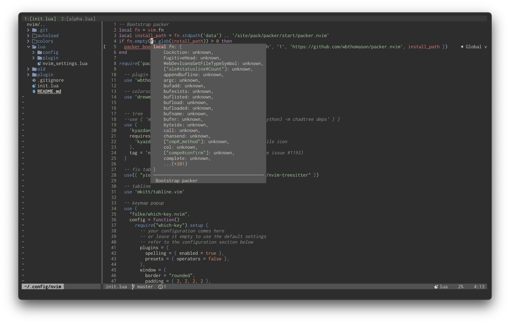
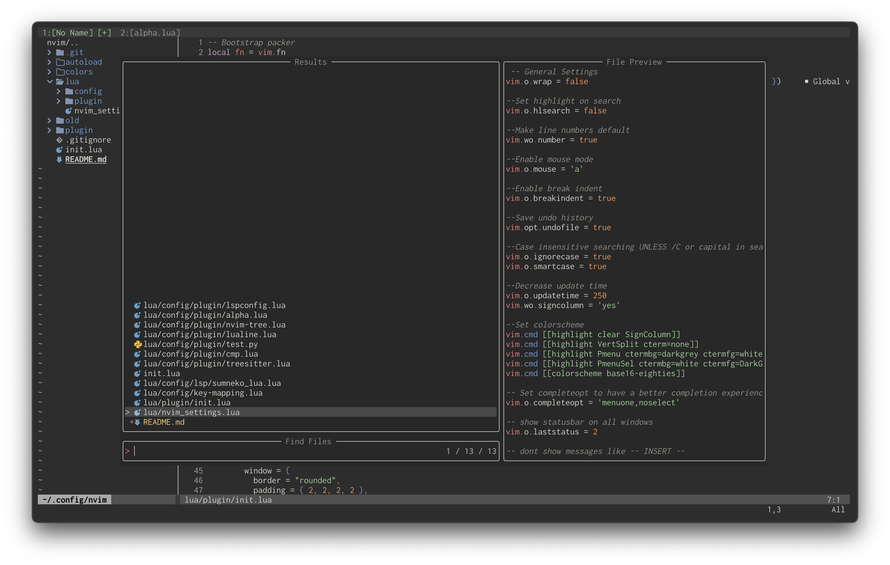

# Nvim configuration




## Features:
  - Install LSPs, Linters, DAPs, with `mason.nvim`
  - Automatic default configuration of installed LSPs
  - Useable with default vim colorschemes
  - Minimal statusbar and tabline
  - Custom base16-colorschemes 
  - `which-key` for keybind discovery
  - completion with `cmp`

## Requirements
- `ripgrep` for fuzzy-finding words
- Any [NerdFont](https://www.nerdfonts.com) for icon support

## Installation
```
git clone https://github.com/drewma2k/nvim ~/.config/nvim
nvim +PackerSync
```

## Post-Installation

### TreeSitter grammars
Install with `:TSInstall <language>`

### Language Servers
Use `:LspInstall` and select a server for the filetype you are currently editing.

## Configuration

### Colorscheme
base16 colorschemes are included for best integration with terminal colors.
colorscheme is configured in `/lua/config/colorscheme.lua`

### Keybinds
Keybinds are configured in `/lua/config/key-mapping.lua`

### Plugins
Plugins are added in `/lua/config/plugin.lua`.
Plugins are generally configured in a file under `lua/config` named after them.

### LSP
LSPs installed by `:LspInstall` are automatically configured with 
nvim-lspconfig.
Custom configurations are done in a dedicated file in `/lua/config/lsp/` or 
directly in `lua/config/lspconfig.lua`

## Goals
- Be tuned to my personal taste
- Rely on native features when appropriate
- Configure all essential IDE features
	- Treesitter
	- LSP
	- Autocomplete
- Be colorscheme agnostic
- Easy to install
- Perfect in every way
